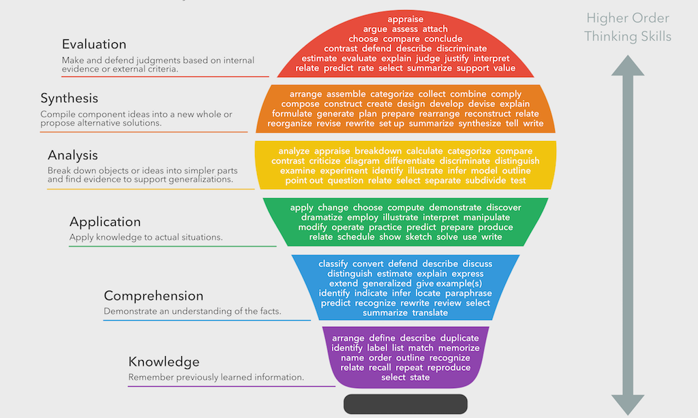

# Paradigms for Online Teaching

### Responsive Design

We live in an ever increasing mobile world. Mobile use has increased by **222%** over the last five years \(as of 2019\) and approximately **50%** of internet use now comes through mobile devices with a continued trend upward. Any teaching that does not consider the use of mobile phones, tablets, and laptops combined will fail to meet the needs and culture of rising generations. 

**Responsive Design** is the concept of designing material so that it is as easily viewable on a mobile device as it is a laptop. Content should either resize to fit the screen or be appropriate for all screen sizes. There a several different medium for presenting content across devices \(mobile, tablet, laptop\) and within each of these mediums are the ability to design with responsiveness in mind.

#### PowerPoint / Keynote / Slides

#### Videos

#### Audio

#### Papers & Docs

#### Outside Links

When linking to external websites and resources, do a quality check to make sure these resources display well on mobile, tablet, and laptop. 

#### Related Resources

* [Percentage of mobile device website traffic worldwide from 1st quarter 2015 to 3rd quarter 2019](https://www.statista.com/statistics/277125/share-of-website-traffic-coming-from-mobile-devices/)
* [Design PowerPoint Slides for Mobile](https://www.inc.com/telecom/articles/200906/powerpoint.html)

### Better Online Discussion

* [Adjust the structure of online discussions](https://www.facultyfocus.com/articles/online-education/organic-online-discussions-saving-time-and-increasing-engagement/) from students starting threads \(from post-and-reply-to-two\) to the instructor starting them which creates a more organic discussion structure similar to classroom conversations.
* Ask open-ended question from the deep end of [Bloom’s Taxonomy.](https://cft.vanderbilt.edu/guides-sub-pages/blooms-taxonomy/)
* [Pin the Instructor-initiated thread](https://moodleuserguides.org/guides/pin-thread-top-discussion-forum/) to the top of the forum to keep it in front of students.

**Add clear instructions.** _Feel free to copy and paste these instructions in your first topic:_ ****

_Students, when you enter the discussions, you will see that I’ve already started a few discussion threads. Please respond to each other \(after the first person responds to me\) to engage with your peers in the threads I started to create great classroom conversations. To keep the conversations going, follow these steps: 1\) Read my initial questions and any peer responses. 2\) Find an interesting comment by one of your classmates and click **Respond**. 3\) Use your classmate’s name and briefly summarize what that person said. 4\) Share new information from the assigned readings and apply it using your critical thinking skills. 5\) Sign your name._

_Remember, the goal of the discussion is to have a great conversation while you are learning about and applying the information you read about in the text, videos, or other readings \(if you didn’t learn something when you wrote your post, dig deeper into the text\). Notice that I ask many initial questions. These comments and questions are there to inspire great conversations, not limit them. Please don’t answer every part of the question–leave some for others to respond to. I will provide further prompts throughout the week, so jump down into the conversation if you’ve come in late–don’t struggle to add something new to the beginning conversation when everyone has already said something: Respond to my more recent prompts._

#### **Related Resources**

[Organic Online Discussions: Saving Time and Increasing Engagement](https://www.facultyfocus.com/articles/online-education/organic-online-discussions-saving-time-and-increasing-engagement/)

